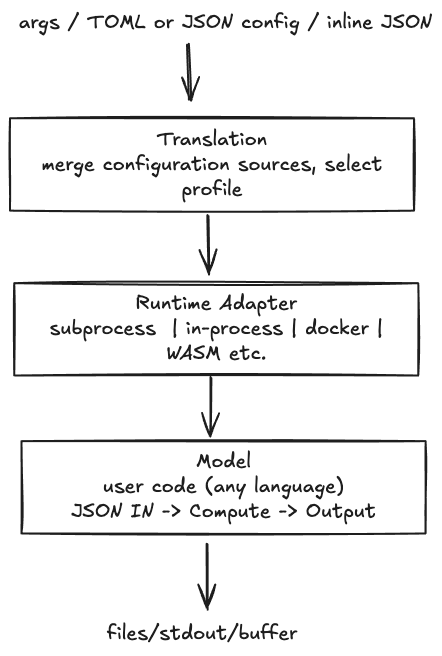

# Model Run Protocol (MRP) Specification

**Version:** 0.0.1
**Status:** Draft

## 1. Overview

MRP is a layered protocol for running computational
disease models across runtimes. It defines a standard
interface between tooling and model code, regardless of
the language the model is written in or the execution
environment it runs within.

A model, at its core, is a function: JSON in, output out.

The protocol operates across three layers:

* **L0 (Model):** The model function itself, accepting
  structured JSON input and producing output.

* **L1 (Runtime):** An adapter that bridges the abstract
  model interface to a concrete execution mechanism
  (subprocess, in-process, WASM).

* **L2 (Translation):** Merges configuration from multiple
  sources — config files, CLI arguments, and programmatic
  input — into the canonical JSON transport format, and
  handles file staging. Implemented as both a library API
  and a CLI.



MRP separates the concerns of *what a model computes*
from *how it is invoked*, *where its inputs come from*,
and *where its outputs go*. This separation allows a
single model implementation to run identically in local
development, CI pipelines, azure batch, and browser-based
WASM environments.

***

## 2. JSON Transport Format

The JSON transport format is the canonical representation
of a single model run. Every model invocation ultimately
receives input in this format, regardless of how the run
was originally specified.

The transport document contains five top-level sections:
`mrp`, `runtime`, `model`, `input`, and `output`.

### Full Example

```json
{
  "mrp": {
    "version": "0.0.1",
    "input_hash": "a1b2c3d4e5f67890"
  },
  "runtime": { "spec": "process", "timeout": 300 },
  "model": {
    "spec": "metapop-model",
    "version": "0.1.2",
    "files": {
      "population": "/tmp/staged/pop.parquet"
    }
  },
  "input": {
    "r0": 2.5,
    "gamma": 0.1,
    "seed": 12345
  },
  "output": {
    "spec": "filesystem",
    "dir": "./results/",
    "format": "csv"
  }
}
```

### `mrp` Section

Protocol metadata. Populated by the SDK; models may read
but should not depend on it.

| Field        | Type   | Required | Description                                                                                                                                                                                                 |
| ------------ | ------ | -------- | ----------------------------------------------------------------------------------------------------------------------------------------------------------------------------------------------------------- |
| `version`    | string | yes      | Semantic version of the MRP spec (e.g. `"0.0.1"`).                                                                                                                                                          |
| `input_hash` | string | yes      | SHA-256 hash (truncated to 16 hex chars) of the canonical JSON transport (excluding `mrp`). Deterministic: identical inputs produce the same hash. Used for deduplication, caching, and output correlation. |

### `runtime` Section

Specifies which runtime adapter executes the model and
any runtime-specific configuration. Keys sit directly on
the section (no `params` wrapper).

| Field     | Type   | Required | Description                                                                                                        |
| --------- | ------ | -------- | ------------------------------------------------------------------------------------------------------------------ |
| `spec`    | string | no       | Runtime adapter spec. One of `"process"`, `"wasm"`, `"inline"`, or a custom adapter name. Defaults to `"process"`. |
| `timeout` | number | no       | Maximum execution time in seconds (process runtime).                                                               |

The `command` and `args` fields are consumed by the
orchestrator and stripped from the transport
(see [Section 3](#3-toml-config-format)).

Runtime supports profiles via `runtime.profile.*` for
named variants (e.g., `local` vs `remote`).
See [Section 3](#3-toml-config-format).

### `model` Section

Describes the model being run.

| Field     | Type   | Required | Description                                                                                            |
| --------- | ------ | -------- | ------------------------------------------------------------------------------------------------------ |
| `spec`    | string | yes      | Model identifier. Used for logging and output routing.                                                 |
| `version` | string | no       | Version of the model's own parameter specification.                                                    |
| `files`   | object | no       | Named file inputs. Keys are logical names; values are absolute local filesystem paths to staged files. |

### `input` Section

Any JSON the model needs. This is a flat key-value object
of model parameters. The protocol imposes no schema on
this section — its contents are entirely model-defined.

```json
{
  "input": {
    "r0": 2.5,
    "gamma": 0.1,
    "seed": 12345
  }
}
```

### `output` Section

A single output sink configuration describing a
destination for model output. Keys sit directly on the
section (no `params` wrapper).

| Field    | Type   | Required | Description                                                                             |
| -------- | ------ | -------- | --------------------------------------------------------------------------------------- |
| `spec`   | string | yes      | Output sink spec. One of `"filesystem"`, `"stdout"`, `"buffer"`, or a custom sink name. |
| `dir`    | string | no       | Directory path for output files (filesystem sink).                                      |
| `format` | string | no       | Output format: `"csv"`, `"parquet"`, `"jsonl"`, `"bytes"`.                              |

Output supports profiles via `output.profile.*` for named
variants (e.g., `default` vs `stdout`).
See [Section 3](#3-toml-config-format).

***

## 3. TOML Config Format

The TOML config format is the primary user-facing
configuration for defining model runs. It maps directly
to the JSON transport format.

### Simple Example (flat)

```toml
[model]
spec = "metapop-model"
version = "0.1.2"

[model.files]
population = "az://container/data/pop.parquet"

[runtime]
spec = "process"
command = "python3"
args = ["-m", "my_model"]
timeout = 300

[output]
spec = "filesystem"
dir = "./results/"
format = "csv"

[input]
r0 = 2.5
gamma = 0.1
```

### Profiles Example

Profiles allow named variants for `runtime` and `output`:

```toml
[model]
spec = "renewal-model"

[runtime.profile.local]
spec = "process"
command = "python3"
args = ["-m", "examples.renewal.renewal"]

[runtime.profile.remote]
spec = "docker"
command = "python3"
args = ["-m", "examples.renewal.renewal"]

[output.profile.default]
spec = "filesystem"
format = "csv"
dir = "./output/"

[output.profile.stdout]
spec = "stdout"

[input]
r0 = 2.0
population_size = 100000
```

### Section Mapping

The TOML structure mirrors the JSON transport format
directly. Only `runtime.command`/`runtime.args` are
consumed by the SDK and stripped before transport.

| TOML Section          | JSON Transport Path | Description                                                                                         |
| --------------------- | ------------------- | --------------------------------------------------------------------------------------------------- |
| `[model]`             | `model`             | Model metadata. `spec` and `version` map directly.                                                  |
| `[model.files]`       | `model.files`       | File inputs. Values in TOML may be URIs; the SDK resolves and stages these to local paths.          |
| `[runtime]`           | `runtime`           | Runtime adapter config (flat keys). `command` and `args` are consumed by the SDK (not transported). |
| `[runtime.profile.*]` | `runtime.profile.*` | Named runtime variants. Selected via `--profile runtime=<name>`.                                    |
| `[input]`             | `input`             | Model parameters (any JSON).                                                                        |
| `[output]`            | `output`            | Output sink config (flat keys).                                                                     |
| `[output.profile.*]`  | `output.profile.*`  | Named output variants. Selected via `--profile output=<name>`.                                      |

### Translation

The TOML structure mirrors the JSON transport directly,
so translation is minimal. See
[Section 4: L2 Translation](#l2-translation) for the
full merge and translation pipeline.

***

## 4. Protocol Layers

MRP is organized into three protocol layers. Each layer
has a single responsibility and communicates with adjacent
layers through well-defined interfaces.

```text
L2  Translation       TOML -> JSON, file staging
    Orchestrator      dispatch between L2 and L1
L1  Runtime Adapter   subprocess, WASM, in-process
L0  Model             accepts JSON, produces output
```

### L0: Model

The model layer is the user's code. A conforming model:

* Accepts a JSON document (the full transport) as its
  sole structured input.

* Produces output to a sink (files, stdout, return value).

* May be written in any language.

* Has no knowledge of file staging. It sees fully resolved
  paths and concrete parameter values.

### L1: Runtime Adapter

The runtime adapter bridges the abstract "call a model
with JSON" interface to a concrete execution mechanism.
Each adapter is responsible for:

* Delivering the JSON transport to the model.

* Capturing model output.

* Reporting success or failure.

See [Section 5: Runtime Adapters](#5-runtime-adapters)
for adapter-specific details.

### Orchestrator (dispatch between L2 and L1)

The orchestrator sits between translation (L2) and
runtime execution (L1). It consumes two inputs: the
translated JSON transport and the original config.

```text
                     config (full)
                        │
                  ┌─────┴─────┐
                  │           │
                  ▼           ▼
L2 Translation → run_json   orchestration keys
                 (clean)    (command, args, profiles)
                  │           │
                  │     ┌─────┘
                  │     │ resolve_runtime()
                  │     ▼
                  │   Runtime adapter
                  │     │
                  └──►  runtime.run(run_json)
                        │
                        ▼
                     L0 Model
```

The transport contains everything the model needs; the
config retains orchestration-only keys (`command`, `args`,
profile selections) that L2 deliberately stripped. The
orchestrator uses these keys to construct the appropriate
runtime adapter, then delegates execution by passing the
clean transport to that adapter.

The **transport path** carries model-facing data:
parameters, file paths, output config. The **dispatch
path** carries execution instructions: which command to
spawn, which runtime profile to use. They converge at the
runtime adapter, which is constructed from the dispatch
path but invoked with the transport path.

`DefaultOrchestrator` resolves a single runtime from
config and calls `runtime.run()`. Custom orchestrators
can implement alternative dispatch strategies (e.g.,
remote submission, retry logic, multi-runtime fan-out)
by overriding the `run()` method while receiving the
same dual inputs.

### L2: Translation

The translation layer merges configuration from multiple
sources into a single canonical JSON transport document.
Sources are applied in descending order of precedence:

1. **Programmatic input** — dictionary overrides passed
   directly via the library API (highest precedence).

2. **CLI arguments** — `--set` overrides and `--profile`
   selections from the command line.

3. **Config files** — TOML configuration files (lowest
   precedence).

After merging, the translation layer performs:

* **File staging.** Resolves all URIs in `model.files` to
  local filesystem paths.

* **`mrp`** **section population.** Computes the `input_hash`
  (SHA-256 of the canonical JSON transport, excluding
  `mrp`, truncated to 16 hex chars) and sets `version`.

* **Orchestration stripping.** Removes `runtime.command`
  and `runtime.args` from the transport.

#### Implementations

* **Library** (`mrp.run()`) — programmatic Python API.
  Accepts a config path and optional dictionary overrides
  (source 1). Does not use CLI arguments (source 2).

* **CLI** (`mrp run`) — command-line interface. Accepts
  a config path with `--set` and `--profile` flags
  (source 2). Does not accept programmatic input
  (source 1).

Both implementations produce identical JSON transport
documents for identical merged inputs.

***

## 5. Runtime Adapters

Each runtime adapter implements the same logical contract:
accept a JSON transport document, execute the model, and
capture output. The mechanism differs per runtime.

| Runtime   | Input Delivery                  | Output Capture                | Use Case                      |
| --------- | ------------------------------- | ----------------------------- | ----------------------------- |
| `process` | JSON on stdin                   | stdout, stderr, filesystem    | CLI tools, R/Python scripts   |
| `wasm`    | JSON via FFI (pointer + length) | FFI return, WASI stdout/files | Browser, sandboxed execution  |
| `inline`  | JSON dict passed to callable    | stdout/stderr capture         | Python models in same process |

### Subprocess (`process`)

The subprocess adapter spawns a child process and writes
the full JSON transport document to its stdin. The model
reads stdin, parses JSON, and writes output to stdout
and/or the filesystem.

```text
SDK --> [stdin: JSON] --> subprocess --> [stdout]
                                    --> [filesystem]
                                    --> [stderr]
```

### Inline (`inline`)

The inline adapter calls a Python callable within the
same process. The JSON transport dict is passed directly
as the sole argument. The adapter captures stdout and
stderr via `sys.stdout`/`sys.stderr` redirection.

Config: `runtime.callable` as a `"module:attr"` dotted
path (e.g., `"my_package.model:run"`).

```python
# Python in-process example
def run(transport: dict) -> None:
    params = transport["input"]
    # ... compute ...
    print(output_data)  # captured as stdout
```

### WASM

TODO

### Docker

TODO

***

## 6. Output Protocol

Model output flows through the output sink defined in
the `output` section of the transport document.

### Output Sinks

| Sink         | Description                                                        |
| ------------ | ------------------------------------------------------------------ |
| `filesystem` | Writes output to files in a specified directory.                   |
| `stdout`     | Writes output to the process's standard output stream.             |
| `buffer`     | Captures output in an in-memory buffer (in-process and WASM only). |

### Output Formats

| Format    | MIME Type                  | Description                                   |
| --------- | -------------------------- | --------------------------------------------- |
| `csv`     | `text/csv`                 | Comma-separated values with a header row.     |
| `parquet` | `application/x-parquet`    | Apache Parquet columnar format.               |
| `jsonl`   | `application/x-ndjson`     | Newline-delimited JSON (one object per line). |
| `bytes`   | `application/octet-stream` | Raw binary output.                            |

***

## 7. CLI Interface

The CLI is one of two implementations of the translation
layer (L2). It reads a TOML config file, applies `--set`
and `--profile` overrides, performs file staging, and
dispatches a single model run through the configured
runtime adapter.

### Basic Invocation

```bash
mrp run mrp.toml
```

### CLI Options

| Flag                | Description                                                                                                    |
| ------------------- | -------------------------------------------------------------------------------------------------------------- |
| `--set KEY=VALUE`   | Override a config value. Dot notation supported (e.g., `--set input.r0=3.0`). May be specified multiple times. |
| `--output-dir PATH` | Override the output directory for filesystem sinks.                                                            |
| `--profile SPEC`    | Select named profiles (e.g., `--profile runtime=local,output=default`).                                        |

### Parameter Overrides

The `--set` flag modifies config values after TOML parsing
but before transport generation:

```bash
mrp run mrp.toml --set input.r0=3.0 --set input.gamma=0.2
```

### Profile Selection

The `--profile` flag selects named profiles for `runtime`
and `output`:

```bash
mrp run mrp.toml --profile runtime=local,output=default
```

### Direct Invocation Without SDK

Models conforming to the subprocess protocol can be
invoked directly without the SDK by piping a JSON
transport document to stdin:

```bash
cat transport.json | ./my-model
```

This bypasses L2 (translation) entirely.

***

## 8. Error Conventions

MRP defines minimal conventions for error reporting.

### Error Output

Models write error information to **stderr**. The runtime
adapter captures stderr separately from stdout.

### Exit Codes

For subprocess runtimes:

| Exit Code | Meaning                                |
| --------- | -------------------------------------- |
| `0`       | Success. Output is valid.              |
| `1`       | Model error. Check stderr for details. |
| `2`       | Invalid input.                         |

***

## 9. File Staging

File staging is a translation-layer (L2) concern. The SDK
resolves all URIs in `model.files` to local filesystem
paths before constructing the JSON transport document.

### Supported URI Schemes

| Scheme  | Example                           | Resolution                           |
| ------- | --------------------------------- | ------------------------------------ |
| Local   | `./data/pop.parquet`              | Resolved to absolute path.           |
| HTTP(S) | `https://example.com/pop.parquet` | Downloaded to a temporary directory. |
| Azure   | `az://container/data/pop.parquet` | Planned (not yet implemented).       |

***

## 10. Extensions

MRP supports custom extensions via the `x-` prefix
convention. Any top-level TOML section or JSON transport
field prefixed with `x-` is reserved for non-standard,
implementation-specific functionality.

### Convention

* Extension keys use the format `x-{name}`
  (e.g., `x-myext`).

* Extensions are consumed by the SDK or tooling that
  understands them. Unknown `x-` sections are ignored.

* Extensions can be used by runtimes, but they must not
  alter the behavior of the core protocol.
